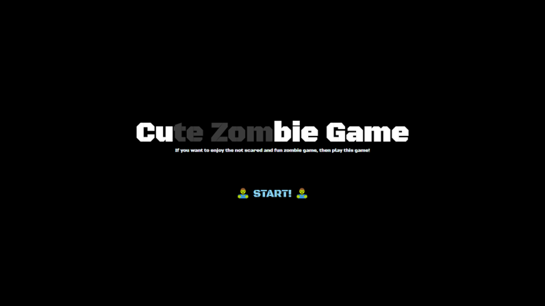
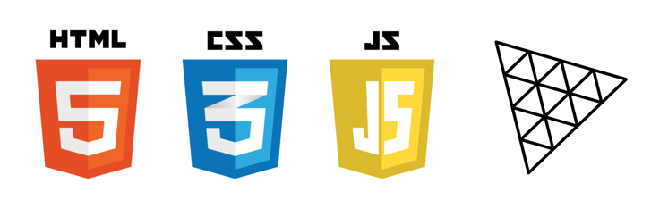
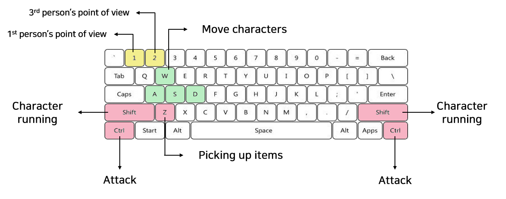
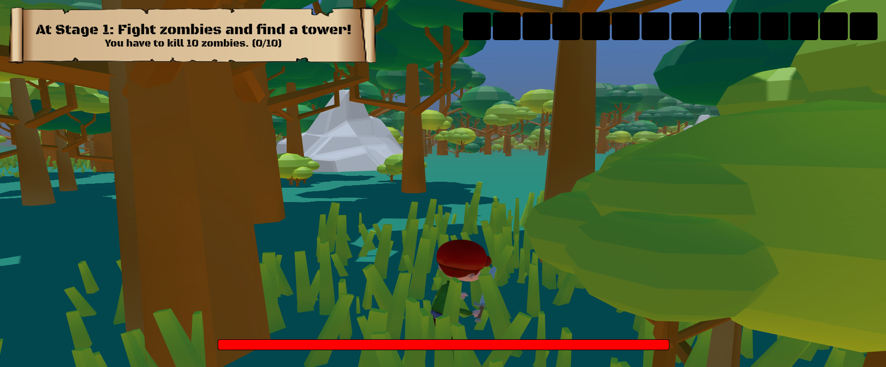
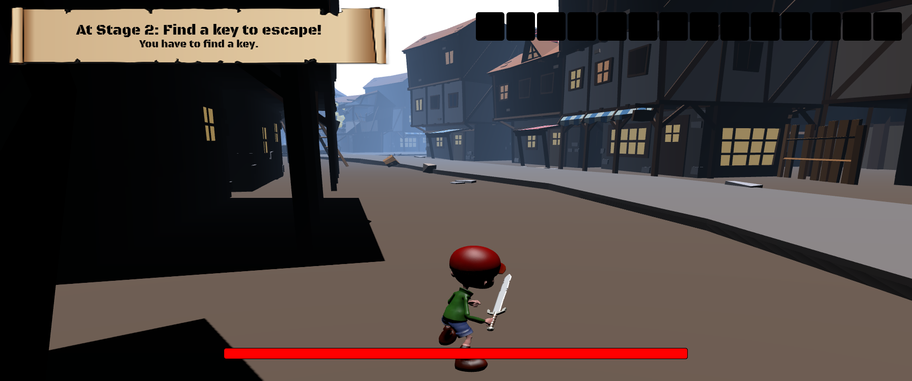
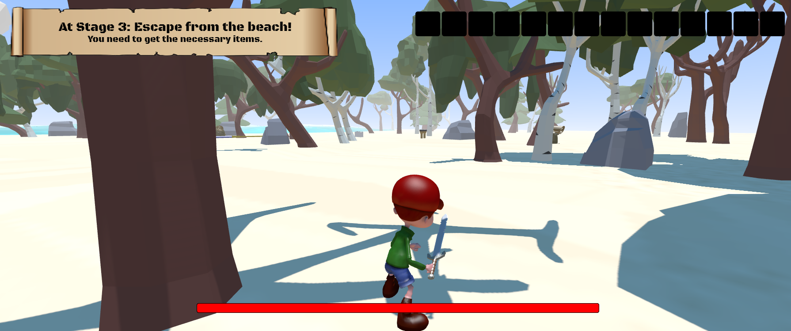

# 🧟 CUBIE GAME 🧟

> <i>Welcome to CU(TE ZOM)BIE GAME!<br/> This is our term project of 2022-2 Computer Graphics using Three.js.</i>

<br/>



<br/>
<br/>

## Using

- <span style="font-size: 18px">**HTML/CSS**</span> mainly to customize the web.
- <span style="font-size: 18px">**JavaScript**</span> mainly to interact with the player.
- <span style="font-size: 18px">**Three.js**</span> mainly for 3D models and game functions.



<br/>
<br/>

## How to Execute the Game

```
Run index.html using a local server. (not mapx.html)
```

<br/>

## How to Play



<br/>
<br/>

## Preview the Game

`Map1: In the Forest`


<br/>
<br/>

`Map2: In the Kingdom/City`


<br/>
<br/>

`Map3: In the Beach`




<br/>
<br/>

## Team Member (Team B)

- 201835541 표지성
- 202035311 김민경
- 202035328 남선우
- 202035359 이도경

<br/>

# THANK YOU!
